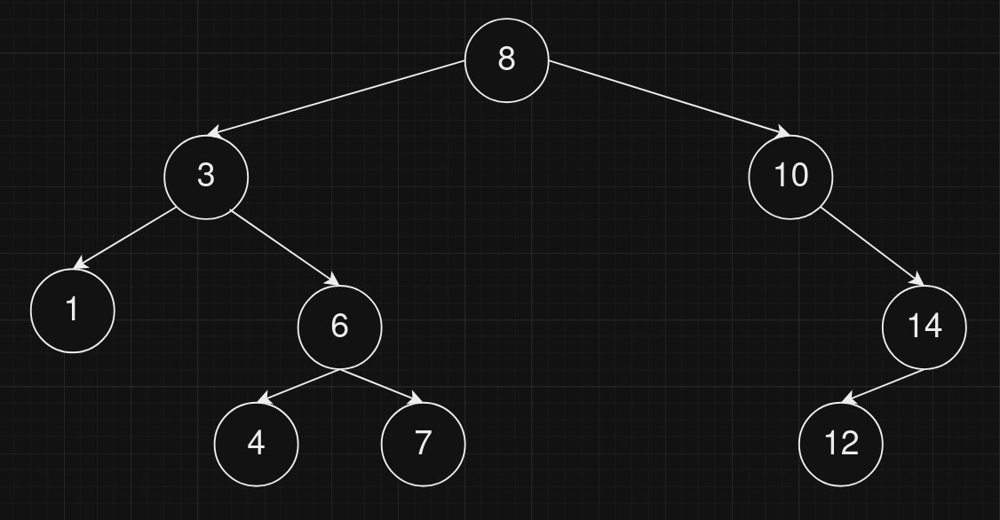
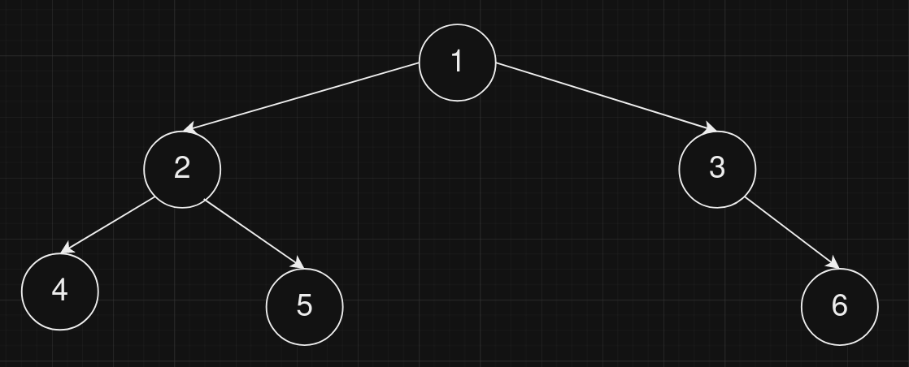

## Preorser traversal format

### The algorithm for preorder traversal is shown as follows:

    Follow step 2 to 4 until root != NULL
    Write root -> data
    Preorder (root -> left)
    Preorder (root -> right)
    End loop

### Examples
- Tree to ptf:
    
    This tree in preorder traversal form would be: **8 3 1 6 4 7 10 14 12**
- Ptf to tree
    **1 2 4 5 3 6** reformed to tree would be
    

### Usage

main.cpp:
``` cpp
#include "preorder_traversal.h"
int cmp(int a, int b) { // your cmp function
    return (a > b) ? 1 : (a < b) ? -1 : 0;
}
int main() {
    std::vector<int> i = {8, 3, 1, 6, 4, 7, 10, 14, 13}; // vector with preorder traversal form
    tree_reformer<int> tree_(i, &cmp); // specialization with type int
    tree_.reform_tree(); // reform eee
    return 0;
}
```